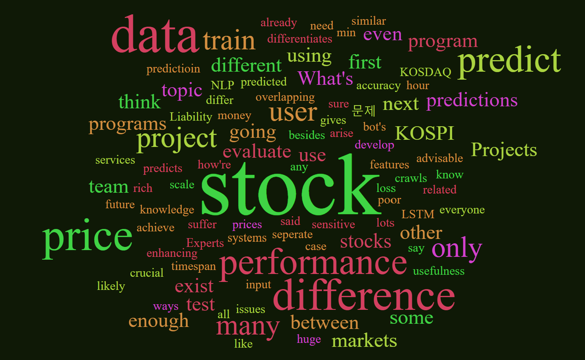
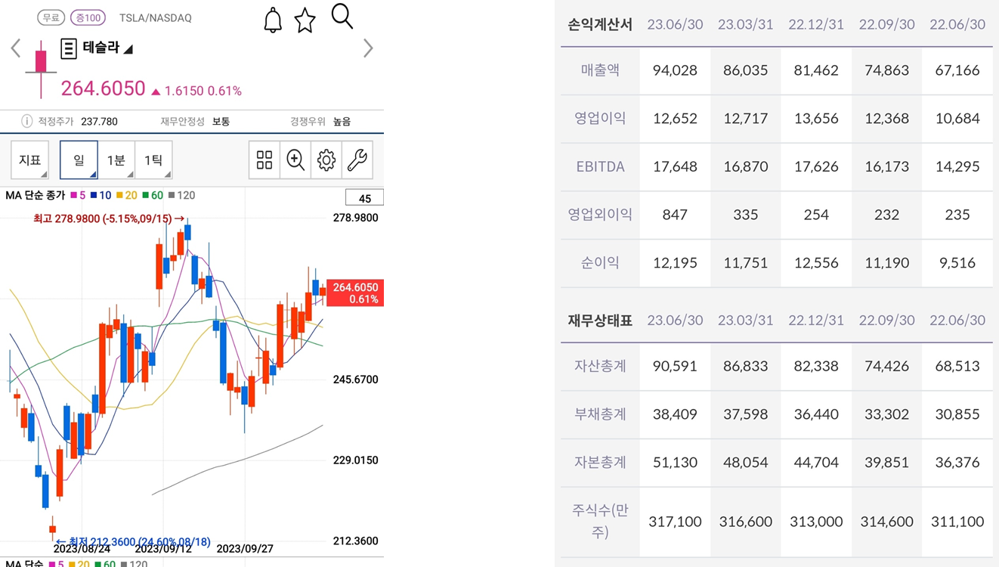
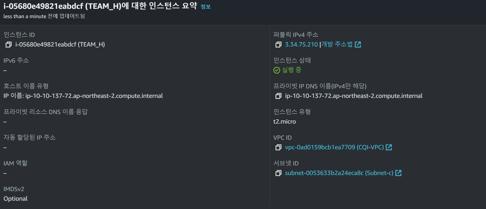
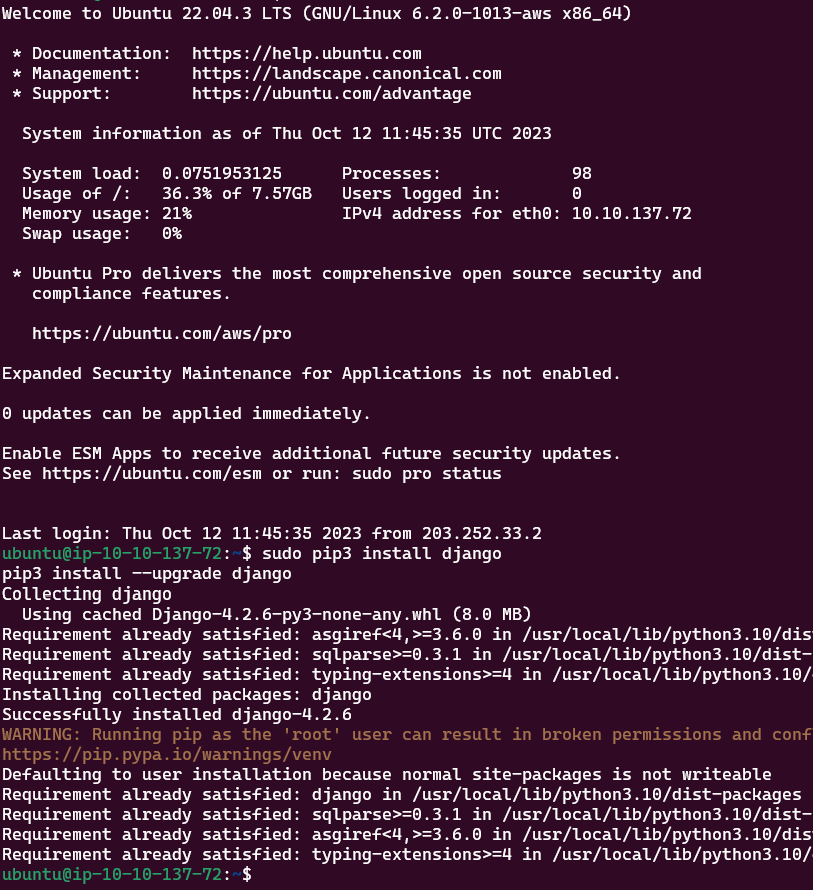
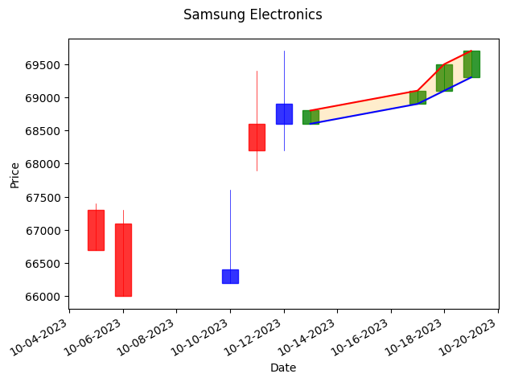

# Remind Our Project

<div class="grid grid-cols-2">

<div>
<h2> Stock Price Prediction Systems</h2>

<h4>

- Not real time prediction
- Predict price of SAMSUNG Electronics

</h4>

</div>
<div>
<div>
	
</div>
</div>

<!-- 
First let me remind you our project.
Our aim is to predict stock prices, but we've made some important adjustments based on the valuable feedback we received from all of you. Initially, we planned to predict stock prices for all stocks in real-time. However, after considering your feedback, we decided to change our focus. Instead, we will now predict stock prices on a day-by-day basis for one or two specific stocks, namely Samsung Electronics and Tesla. These two stocks were selected because they have substantial trading volumes in Korea and the United States.
 -->

---

# Feedbacks
<div class="grid grid-cols-2">

<div>
<h3>What's the difference between our project and other services?
<h3>Predicting stock prices is difficult.
</div>
<div>
	
</div>
</div>

<!-- 
Now, let's address some of the feedback we received: 
As you see in this figure, most of you wondered about mainly two things. 

1. What's the difference between our project and the other service?
2. Pridicting stock price is difficult.
-->


---

## What's the difference? 


<!-- 
So, first What's the difference. 

To clarify this point, let's consider our target users. I presume that many of you may not be familiar with how expert level fund managers or individual investors work. For professionals, generally, asset allocation is more crucial than predicting the exact stock price. Therefore, most stock price prediction systems focus on asset allocation. Of course, it involves recommending when to buy or sell, and forecasting the price's future trends based on many variables. But these systems tend to be quite complex and focused towards experienced users. In contrast, our projects typically target normal people who rely on simple chart analysis and intuition.
 -->

---

## Predicting stock prices is difficult.



<!-- 
We do not want to dive deep into analyzing a company's fundamentals, studying financial statements, or tracking various news events. Instead, we aim to predict the short-term movement of blue-chip stocks. It is known to be a common and successful strategy for short time ranging from a few days to a few months. So, our project's focus is on predicting stock prices in the short term, but not in real-time, and for a limited number of stocks. I think it may be helpful for general users and much easier to predict stock price than before. 

Well, it is still difficult. But I beileve our team can make it.
 -->

---

## Front-end Progress : Django Installation 

<div class="grid grid-cols-2">

<div>
<div>
	
</div>
</div>
<div>
	
</div>
</div>

<!-- 
Our front-end development is underway, but it's still in the early stages. 
We've set up an EC2 instance on Amazon AWS and installed Django, which will serve as the foundation for our web application. 
 -->

---

## Front-end Progress : Test Plot of Stock Price



<!-- 
we're now discussing how to present the data. We plan to display the expected range of the highest and lowest stock prices each day from tomorrow to about a week. 
Note that it is just a sample image.
-->

---

## Front-end Progress : Test Plot of Stock Price


<!-- 
Additionally, if possible, we hope to provide predictions categorized as "strong probable," "probable," and "less probable" to make it easier for users to make  decisions.
 -->

---

## Back-end Progress: Data class for train and test

Train Date : 2000~2022  
Test Data : 2023

```python
class FinanceDataset(Dataset):
    def __init__(self, data_args, mode='train'):
	...
        if self.stock_id == 'samsung':
            if mode == 'train':
                df = fdr.DataReader('005930','2000','2022')
            elif mode == 'test':
                df = fdr.DataReader('005930','2022','2023')
	...
    df = df[['Open', 'High', 'Low', 'Volume', 'Close']]
    scaler = MinMaxScaler()
    df = scaler.fit_transform(df)
```

<!-- 
On the back-end, we've made progress in building our dataset. For SAMSUNG Electronics, We'll use data from 2000 to 2022 as train data, data from this year as test data. We're going to use several key variables, including Open price, High price, Low price, Trading volume, and Close price, to train our machine learning model. 
 -->

---

## Back-end Progress : Implementation LSTM

<!-- 
As mentioned in our previous presentation, we have four potential models in mind. 
Among them, we've started implementing the LSTM model. For reminding, LSTM, which is Long Short term memory. It is known to be able to resolve gradient vanishing problem as the size of time-sequencial data increases.
 -->


--- 

## Back-end Progress : Implementation LSTM

```python
class FinanceLSTM(nn.Module):
    def __init__(self, model_args):
        super(FinanceLSTM, self).__init__()

        self.output_length = model_args.output_length
        self.num_layers = model_args.num_layers
        self.input_size = model_args.input_size
        self.hidden_size = model_args.hidden_size
        self.fc_hidden_size = model_args.fc_hidden_size
        self.dropout = model_args.dropout

        self.lstm = nn.LSTM(input_size = self.input_size, hidden_size = self.hidden_size,
                            num_layers = self.num_layers, dropout = self.dropout, batch_first = True)
        self.fc1 = nn.Linear(self.hidden_size, self.fc_hidden_size)
        self.fc2 = nn.Linear(self.fc_hidden_size, self.output_length)
        self.relu = nn.ReLU()
```

---

## Back-end Progress : Implementation LSTM
```python
class FinanceLSTM(nn.Module):
...
    def forward(self, x):

        h_0 = torch.Tensor(torch.zeros(self.num_layers, x.size(0), self.hidden_size))
        c_0 = torch.Tensor(torch.zeros(self.num_layers, x.size(0), self.hidden_size))

        output, (hn, cn) = self.lstm(x, (h_0, c_0))
        hn = hn.view(-1, self.hidden_size)
        logits = self.relu(hn)
        logits = self.fc1(logits)
        logits = self.relu(logits)
        logits = self.fc2(logits)

        return logits
```


---

# Plans for Next Progess Meeting


<h2> Donghun Jung </h2>


- Creating the initial UI/UX design

<h2>Chanyoung Lee, Yujin Seo</h2>

- Implementing GRU, CNN, Transformer


<!-- 
Next time, I hope to show initial version of web deploy and implementation of models.
 -->